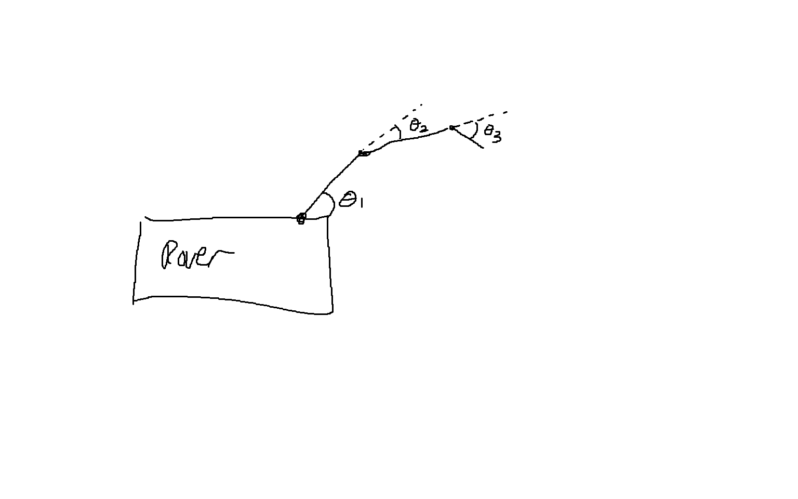

# 3 DOF Arm MATLAB Simulation

Kinematics, dynamics and reach simulation for the URC rover's 3-joint arm.
Everything runs from a single script, `robot_arm_kinematics.m`.

From the parameters, the script generates:

- A forward/inverse kinematics check (first figure)
- A motor torque graph for a sample move, plus holding torques
- The worst-case torque on each joint, over every pose the arm can reach
- The reach envelope of the arm on the rover
- A test move between two points, with a torque graph and an animation

**Requirements:** MATLAB R2016b or newer. No toolboxes are needed.

**To run:** open `robot_arm_kinematics.m`, edit the parameters described below, and run it.

> Line numbers below refer to `robot_arm_kinematics.m`. They shift if lines are added or removed, so each one also lists the variable name to search for.

## 1. Arm parameters

| Line | Variable | Description |
|---|---|---|
| 12 | `arm.L` | Length of each link [m], `[L1 L2 L3]` |
| 13 | `arm.qmin` | Minimum angle of each joint, `[Joint 1, Joint 2, Joint 3]` (entered in degrees inside `deg2rad(...)`) |
| 14 | `arm.qmax` | Maximum angle of each joint, same order |
| 17 | `arm.m` | Mass of each link [kg], `[link 1, link 2, link 3]` |
| 31 | `arm.qdmax` | Maximum speed of each joint [rad/s] (entered in deg/s inside `deg2rad(...)`). Used for the worst-case torque and to check test moves. |
| 32 | `arm.qddmax` | Maximum acceleration of each joint [rad/s²] (entered in deg/s² inside `deg2rad(...)`). Used the same way. |

### How the joint angles are measured



- **Joint 1 (θ1)** is measured from horizontal (forward along the ground).
- **Joint 2 (θ2)** and **joint 3 (θ3)** are measured relative to the link before them (the dashed lines). 0° means the link is in line with the previous link.
- Positive angles rotate counterclockwise, which is upward when the arm reaches forward.

## 2. Load and mount parameters

| Line | Variable | Description |
|---|---|---|
| 22 | `arm.mp` | Mass of the load held by the gripper [kg]. `0` = no load. |
| 23 | `arm.lp` | Distance from the wrist joint (joint 3) to the load's center of mass [m]. See the note below. |
| 24 | `arm.Ip` | Inertia of the load about its own center of mass [kg·m²]. For a solid cube of side `s`: `arm.mp*(s^2 + s^2)/12`. |
| 38 | `mount.h` | Height of the arm base (joint 1) above the ground [m]. |
| 39 | `mount.clear` | Minimum clearance any part of the arm keeps above the ground [m]. |
| 40 | `mount.box` | Rover body keep-out rectangle `[xmin xmax ymin ymax]` [m]. Set to `[]` to ignore the rover body. |

**Note on `arm.lp`:** it's currently set to `arm.L(3)`, which puts the load's center of mass at the gripper tip. For a real load it's larger than the gripper length. For example, a 40 cm box gripped from the top has its center of mass about 0.20 m past the tip:

```matlab
arm.lp = arm.L(3) + 0.20;
```

### Coordinate system

All positions you enter are relative to the ground:

- **x = 0** is directly below the arm's base joint (joint 1), positive forward.
- **y = 0** is the ground, positive up.

## 3. Worst-case joint torques

The script finds the largest torque each joint will ever need, for whatever arm, mount and load parameters are set. Use these numbers to size the motors. Set `arm.mp` to the heaviest load the arm will carry.

It reports two values per joint:

| Value | Meaning |
|---|---|
| Static | Largest torque to **hold the arm still** (gravity only), over every pose |
| Dynamic | Largest torque with the joints **moving at up to `arm.qdmax` and accelerating at up to `arm.qddmax`**, in the worst combination of directions, over every pose |

The Command Window prints a table of both, along with the pose causing the dynamic worst case. A figure shows each joint's worst static pose (grey) and dynamic pose (red).

**How it works:**
1. It checks a grid of poses (line 125, 12 angles per joint, plus 0°). It keeps only poses that are within the joint limits and clear of the ground and rover body.
2. For each pose it finds the worst speeds and accelerations. Acceleration torque is linear, so the worst case is every joint at full acceleration in the direction that adds to the torque. Speed torque is checked at every combination of full speed forward, stopped, and full speed backward.
3. The best few poses for each joint are refined with a pattern search, which nudges each joint until no move increases the torque. It never leaves the valid poses.

**Keep in mind:**
- The dynamic value is a **conservative upper bound**. It assumes every joint can be at full speed and full acceleration at the same time, which a real move rarely does.
- Friction, motor rotor inertia and gearbox losses aren't included, so add a safety factor before choosing motors.
- It takes a few seconds. Raise the 12 on line 125 for a finer search, at the cost of time.

## 4. Testing a move

You can test the arm going from one point to another. The output is a torque graph and an animation of the arm's solution.

| Line | Variable | Description |
|---|---|---|
| 168 | `testTarget` | Coordinates of the final position, `[x, height]` [m] |
| 169 | `testPhi` | Final angle of the gripper* |
| 172 | `testStartMode` | Type of starting point: `'position'` or `'angles'` |
| 173 | `testStartPos` | Coordinates of the starting position, `[x, height]` [m] |
| 174 | `testStartPhi` | Starting angle of the gripper* |
| 175 | `testStartElbow` | Preferred starting elbow, `'up'` or `'down'` |
| 176 | `qStartAngles` | Joint angles of the starting position, `[θ1 θ2 θ3]` |
| 178 | `testTf` | Duration of the move [s] |
| 179 | `testAnimate` | `true` to play the animation, `false` to skip it |

Whether the code uses lines 173–175 (position) or line 176 (angles) depends on the value of line 172.

If the move is too fast for `arm.qdmax` or `arm.qddmax`, the script prints a warning with the shortest `testTf` that works.

\* **Why the gripper angle must be set:** with 3 motors and a position with only 2 values (x and height), the problem is undefined, because infinitely many arm poses reach the same point. The gripper angle must therefore be defined beforehand. It's measured from horizontal:

| Gripper angle | Meaning |
|---|---|
| `0°` | Pointing straight forward |
| `-45°` | Angled down |
| `-90°` | Pointing straight down (e.g. picking up off the ground) |

### Checking a single point

Line 156 (`target`) sets a point that the script checks for reachability at any gripper angle. If it is reachable, the script prints joint angles that reach it. The height must be at least `mount.clear`, or the tip would be too close to the ground.

### If a move fails

The Command Window says why:

- The target is out of reach.
- Every solution violates the joint limits at that gripper angle.
- The solution collides with the ground or the rover body.
